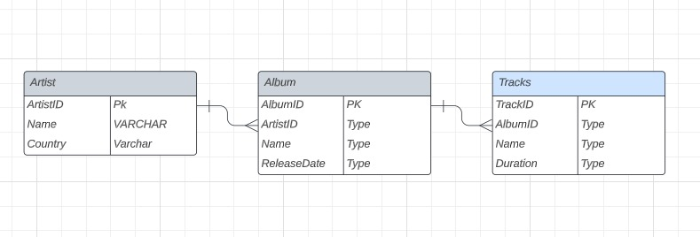

# go-crud


## Description

This is a simple project written in Go to build a CRUD app with a postgres database.
The aim of the app is to create, delete and get info about artists or music bands. 

<div style="text-align: center;">



</div>

## Getting Started

### Dependencies

- Go version 1.20+

[//]: # (- Only works on ECS task)

### Installing

- Clone the repo: `git clone https://github.com/FranP0610/go-crud.git`
- Navigate into the cloned project: `cd <repo-name>`


### Executing program

1. **create the env file**: I have uploaded a template, all you have to do is change the values.
    ```bash
    vim cmd/go-crud/.env
    ```
2. **Deploy a postgresql database**: In my case a used a docker deployment for the database
    ```bash
        docker run --name <Name of the cointainer> -e POSTGRES_USER=admin -e POSTGRES_PASSWORD=password -p 5432:5432 -d postgres:14.8-bookworm 
    ```
3. **Create the database**: You have to connect to the database and execute the following command:
    ```sql
        CREATE DATABASE <DB_NAME>;
    ```
4. **Running the app**
    ```bash
        cd cmd/crud-api
        go run main.go
    ```


## Contributing

Pull requests are welcome. For major changes, please open an issue first to discuss what you would like to change.

## License

This project is licensed under the [MIT License](LICENSE).

## Authors

-  [@FranP0610](https://github.com/FranP0610)

## Version History

- 0.1
    - Initial Release
